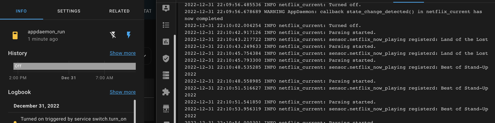
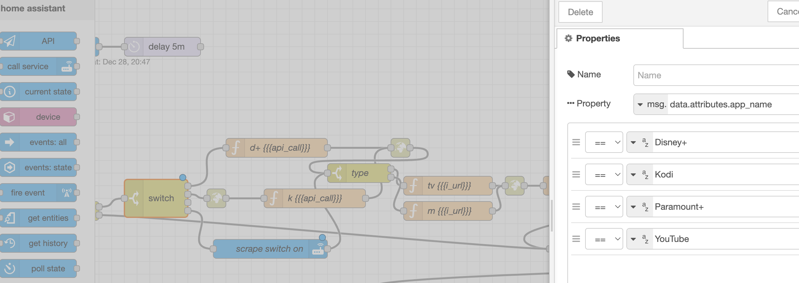

# nowFlix

the /appdaemon/ folder includes a config.yaml, a scripts.yaml, and a switch.yaml.

- config.yaml: AppDaemon add-on config requirements. Add as needed.
- scripts.yaml: HA script template. Used to call AppDaemon service with payload.
- switch.yaml: HA switch template. Used to enable/disable the AppDaemon app.

The actual app + apps.yaml def are in /appdaemon/apps/

Deployment Preparation:** prep needed: you need to change

<b>nowflix.py</b>

- line 30: Netflix username
- line 31: Netflix password
- line 70: Currently the while loop automaticlly starts again. Uncomment / edit line to add sleep at end of while loop.

The way it the apps works is that it uses selenium to scrape https://netflix.com/viewinghistory and creates sensor.netflix_now_playing with the info. If the switch is turned on, the appdaemon app will loop and continually scrape /viewinghistory with Selenium. [you might get an email or two at first about a new device].

<b>AppDaemon log</b>

*When switch is on, the while:loop runs continually*

The way I use it is: When SHIELD app_name = Netflix, turn switch.appdaemon_run on. I'm using Node-Red + sensor.netflix_now_playing to watch for changes, and then it turns the switch off, thus stopping the scraping since I obviously started a new media file.

*switch node option 4, Netflix - turns on switch.appdaemon_run*

It works... the flow needs work and I want to really turn it into an integration or an addon if that's possible, but the selenium + chrome-webdriver reqs make it a finicky application. Pyscrypt(?) might work, but I've never used it
